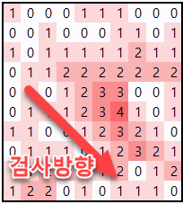

<!-- Morgorithm Study #1 -->
# Morgorithm Study #1 
<!-- 주어진 과제 목록 -->
## *pre-task*  
  >Baekjoon 1915 - The largest square  
  >Baekjoon 1596 - Young-sik function  
  >Codeforces 1181B - Split a number  
  
Solve two or more problems.  
Prepare to briefly describe the problems have solved.  
  
## *Schedule*  
<!-- 실제 모임 시간과 모임이 이루어진 장소-->
  >2019.07.10 (Wed) 16:00 ~ 19:00  
  >Korea Polytech University E519  
  
## *task*  
<!-- 개인별 task 작성 가이드
 수정 후 기존 파일의 링크 유지(새로운 이름으로 업로드)
  >**Hong Gil-dong's**  
  >[x]Baekjoon 1915 - [Source](https://github.com/Gildong/Morgorithm/blob/master/Week1/Baekjoon1596_gildong.cpp)  
  >[x][Site name] [Problem number] - [~~Source~~](https://github.com/Gildong/Morgorithm/blob/master/Week1/Baekjoon1915_gildong.cpp) - 
  [Edited](https://github.com/Gildong/Morgorithm/blob/master/Week1/Baekjoon1596_gildong_v2.cpp)  
  >[x]Codeforeces 1181B - [Source](https://github.com/Gildong/Morgorithm/blob/master/Week1/Codeforces1181B_gildong.cpp)  
  -->

  >**kjs28's**  
  >[ ]Baekjoon 1915 - [Source]()  
  >[ ]Baekjoon 1596 - [Source]()  
  >[ ]Codeforeces 1181B - [Source]()  
  
  >**SightStudio's**  
  >[ ]Baekjoon 1915 - [Source]()  
  >[ ]Baekjoon 1596 - [Source]()  
  >[ ]Codeforeces 1181B - [Source]()  
  
  >**tristan3716's**  
  >[x]Baekjoon 1915 - [Source](https://github.com/tristan3716/Morgorithm/blob/master/Week1/Baekjoon1596_Hyeon-uk.cpp)  
  >[x]Baekjoon 1596 - [Source](https://github.com/tristan3716/Morgorithm/blob/master/Week1/Baekjoon1915_Hyeon-uk.cpp)  
  >[x]Codeforeces 1181B - [Source](https://github.com/tristan3716/Morgorithm/blob/master/Week1/Codeforces1181B_Hyeon-uk.cpp)  
  
  >**OctopusSwellfish's**  
  >[ ]Baekjoon 1915 - [Source]()  
  >[ ]Baekjoon 1596 - [Source]()  
  >[ ]Codeforeces 1181B - [Source]()  
  
## *Studies*  
<!-- 스터디 진행간 토의한 내용, 피드백 결과 등을 기록 -->
<!-- Input Size, Complexity requirements, Algorithm Category, Descriptions -->
  >**Baekjoon 1915 - 가장 큰 정사각형**  
  >>Input size : n, m <= 1000  
  >>Requirements : Time complexity should be less than O(nm * 100)  
  >>Category : DP  
  >>  
  >>2x2 크기의 정사각형이 1로 구성되어있는지 검사  
  >>검사 결과에서 다시 2x2 크기의 정사각형을 검사하면 3x3 크기의 정사각형을 찾을 수 있음  
  >>  
  >>  
  >>DP를 적용하여 현재 위치에서 조사한 정사각형의 넓이를 저장  
  >  
  >**Baekjoon 1596 - 영식 함수**  
  >>Input size : 1 <= a <= b <= 1,000,000,000  
  >>Requirements : Time complexity should be less than O(b / 10)  
  >>Category : Brute-force  
  >>  
  >>어떤 수 X의 지문을 얻는 데 필요한 시간 : O(logb * logb)  
  >>임의의 수 X에 대해 X의 지문을 얻는 데 필요한 시간 : O(b * logb * logb)  
  >>따라서, 모든 수를 검사하기 시작하면 1%도 검사하지 못하고 *Time Limit Exceed*  
  >>  
  >>알고있는 사실에 기반하여 접근할 필요 > **임의의 수 X의 지문은 7이다.**  
  >>7에서 시작하여 거꾸로, 가능한 모든 경우를 역추적 (*brute-force*)  
  >  
  >**Codeforces 1181B - Split a Number**  
  >>Input size : 2 <= l <= 100,000  
  >>Requirements : Time complexity should be less than O(l^2)  
  >>Category : Greedy  
  >><!-- Feel free to add comments anywhere -->  
  >>>***Comment*** *to OctopusSwellfish from Hyeon-uk*  
  >>>그런 경우에 대비해서 BIG_INTEGER 자료형이 있어요.  
  >>
  >>두 BigInteger를 더하기 위해 필요한 시간 O(L)  
  >>입력값을 모든 가능한 두 수로 나누는데 필요한 시간 O(L)  
  >>모든 경우에 대해 더하는 경우 반드시 *Time Limit Exceed*  
  >>따라서 숫자를 더하지 않고, 모든 경우를 탐색할 필요성
  >>
  >>  
  >>**두 수의 합은 중간에서 자를 때 가장 작다**  
  >>순서대로 모든 가능한 위치에 대해 "두 수의 차이"를 저장하고 이를 비교.  
  >>차이가 가장 작은 위치가 합이 가장 작은 경우  

## *Next schedule*  
<!-- 다음 스터디 수행 일정(이슈)을 태그함 -->
  >[Morgorithm Study Schedule \#2](#1)